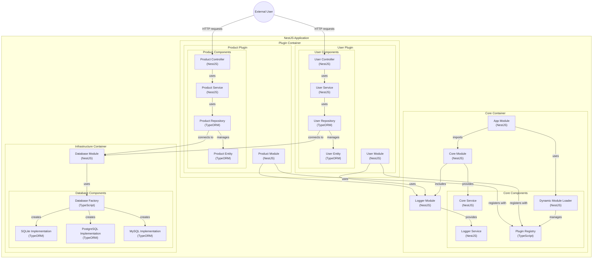

```mermaid
graph TB
    User((External User))

    subgraph "NestJS Application"
        subgraph "Core Container"
            AppModule["App Module<br>(NestJS)"]
            CoreModule["Core Module<br>(NestJS)"]
            LoggerModule["Logger Module<br>(NestJS)"]
            
            subgraph "Core Components"
                CoreService["Core Service<br>(NestJS)"]
                LoggerService["Logger Service<br>(NestJS)"]
                PluginRegistry["Plugin Registry<br>(TypeScript)"]
                DynamicLoader["Dynamic Module Loader<br>(NestJS)"]
            end
        end

        subgraph "Plugin Container"
            subgraph "User Plugin"
                UserModule["User Module<br>(NestJS)"]
                
                subgraph "User Components"
                    UserController["User Controller<br>(NestJS)"]
                    UserService["User Service<br>(NestJS)"]
                    UserRepository["User Repository<br>(TypeORM)"]
                    UserEntity["User Entity<br>(TypeORM)"]
                end
            end

            subgraph "Product Plugin"
                ProductModule["Product Module<br>(NestJS)"]
                
                subgraph "Product Components"
                    ProductController["Product Controller<br>(NestJS)"]
                    ProductService["Product Service<br>(NestJS)"]
                    ProductRepository["Product Repository<br>(TypeORM)"]
                    ProductEntity["Product Entity<br>(TypeORM)"]
                end
            end
        end

        subgraph "Infrastructure Container"
            DatabaseModule["Database Module<br>(NestJS)"]
            
            subgraph "Database Components"
                DatabaseFactory["Database Factory<br>(TypeScript)"]
                SQLiteDB["SQLite Implementation<br>(TypeORM)"]
                PostgresDB["PostgreSQL Implementation<br>(TypeORM)"]
                MySQLDB["MySQL Implementation<br>(TypeORM)"]
            end
        end
    end

    %% Core Container Relationships
    AppModule -->|imports| CoreModule
    CoreModule -->|provides| CoreService
    CoreModule -->|includes| LoggerModule
    LoggerModule -->|provides| LoggerService
    AppModule -->|uses| DynamicLoader
    DynamicLoader -->|manages| PluginRegistry

    %% Plugin Container Relationships
    UserModule -->|registers with| PluginRegistry
    ProductModule -->|registers with| PluginRegistry
    
    UserController -->|uses| UserService
    UserService -->|uses| UserRepository
    UserRepository -->|manages| UserEntity
    UserModule -->|uses| LoggerModule
    
    ProductController -->|uses| ProductService
    ProductService -->|uses| ProductRepository
    ProductRepository -->|manages| ProductEntity
    ProductModule -->|uses| LoggerModule

    %% Infrastructure Container Relationships
    DatabaseModule -->|uses| DatabaseFactory
    DatabaseFactory -->|creates| SQLiteDB
    DatabaseFactory -->|creates| PostgresDB
    DatabaseFactory -->|creates| MySQLDB

    %% Cross-Container Relationships
    UserRepository -->|connects to| DatabaseModule
    ProductRepository -->|connects to| DatabaseModule

    %% External User Interactions
    User -->|HTTP requests| UserController
    User -->|HTTP requests| ProductController
```